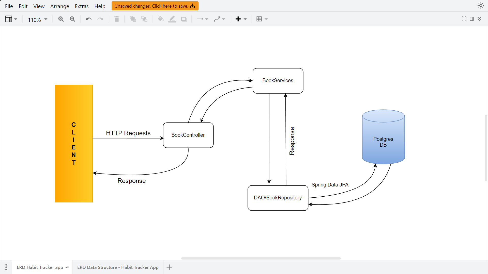
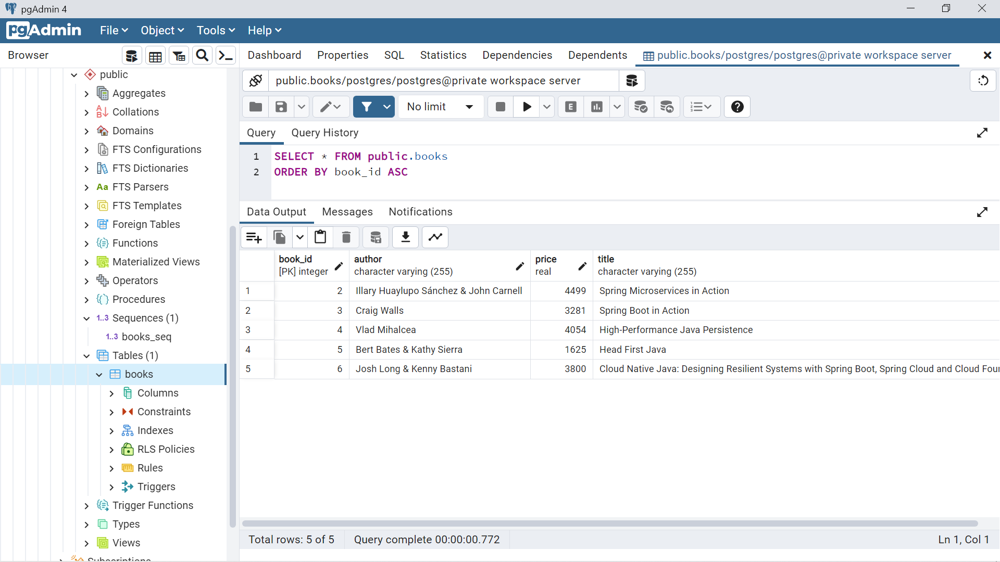

<h1 align="center">
  🏷️ Book API
</h1>

<p align="center"> 👀 A basic REST API using Spring Boot </p>

<br>

## 🛰 Project Architecture

<br>

## 📦 Tools and Tech Stack
* Spring Boot
* Spring Data JPA
* PostgreSQL
* IntelliJ Idea Ultimate
* PgAdmin4
* Insomnia/ Postman


## 🛠 Installation

* Clone this repo (or you can download the zip)
```
git clone "https://github.com/RhoNit/dummyapi.git"
```

* Open the project (maven project) in an IDE

* Configure and run the SpringApplication (here it is ```DummyapiApplication```)

* Visit ```localhost:8080```
```
http://127.0.0.1:8080/books
```

## 🚀 APIs/Routes
* ### Add a book
```
POST /books
Accept: application/json
Content-Type: application/json

{
  "id" : 6,
  "title" : "Cloud Native Java: Designing Resilient Systems with Spring Boot, Spring Cloud and Cloud Foundry",
  "author" : "Josh Long & Kenny Bastani",
  "price" : 4010.0
}

RESPONSE: HTTP 201 (Created)
Location header: http://localhost:8080/books/6
```
<hr>

* ### Update a book by Id
```
PUT /books/{id}
Accept: application/json
Content-Type: application/json

{
  "id" : 6,
  "title" : "Cloud Native Java: Designing Resilient Systems with Spring Boot, Spring Cloud and Cloud Foundry",
  "author" : "Kenny Bastani",
  "price" : 3800.0
}

RESPONSE: HTTP 200 (Ok)
Location header: http://localhost:8080/books/6
```
<hr>

* ### Delete a book by Id
```
DELETE /books/{id}

RESPONSE: HTTP 200 (Ok)
```
<hr>

* ### Get a book by Id
```
GET /books/{id}

RESPONSE: HTTP 200 (Ok)
{
    "id": 6,
    "title": "Cloud Native Java: Designing Resilient Systems with Spring Boot, Spring Cloud and Cloud Foundry",
    "author": "Kenny Bastani",
    "price": 3800.0
}
Location header: http://localhost:8080/books/6
```
<hr>

* ### Get all books
```
GET /books

RESPONSE: HTTP 200 (Ok)
[
    {
        "id": 3,
        "title": "Spring Boot in Action",
        "author": "Craig Walls",
        "price": 3281.0
    },
    {
        "id": 4,
        "title": "High-Performance Java Persistence",
        "author": "Vlad Mihalcea",
        "price": 4054.0
    },
    {
        "id": 2,
        "title": "Spring Microservices in Action",
        "author": "Illary Huaylupo Sánchez & John Carnell",
        "price": 4499.0
    },
    {
        "id": 5,
        "title": "Head First Java",
        "author": "Bert Bates & Kathy Sierra",
        "price": 1625.0
    },
    {
        "id": 6,
        "title": "Cloud Native Java: Designing Resilient Systems with Spring Boot, Spring Cloud and Cloud Foundry",
        "author": "Kenny Bastani",
        "price": 3800.0
    }
]
Location header: http://localhost:8080/books
```
<br>

## 🛢️ Database Schema

<br>

## 🎯 Bullseye (Building a Docker Imange and Publishing to Docker Hub)
- Tried to Dockerize the application
- But facing some issues
- Working on it
